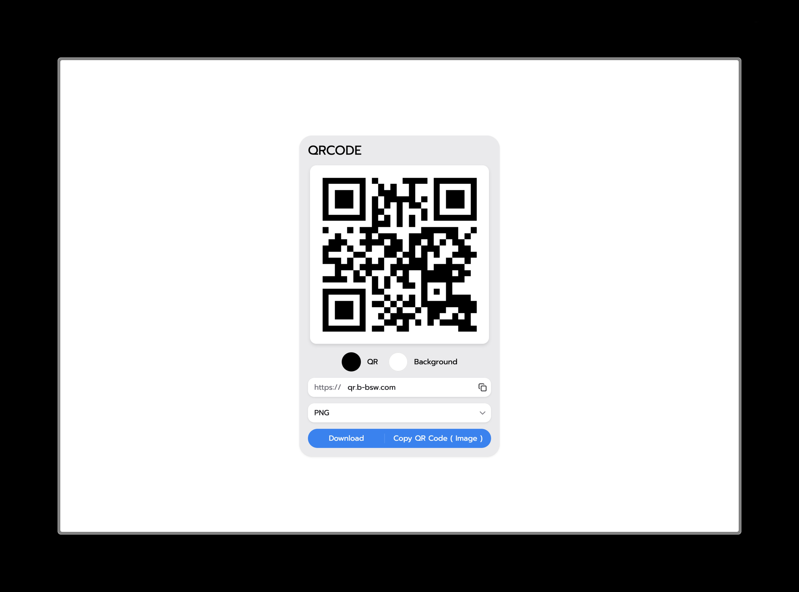

# This is QrCode generator

> Nextjs@16 + Tailwind + HeroUI

---
## Web UI
<div align="center">
    
</div>

[qr.b-bsw.com](https://qr.b-bsw.com)

---

## How to run

- Install dependency

```bash
bun install
# or
npm install
```

- run

```bash
bun dev
# or
npm run dev
```

---

> This Project Make from My pain point.
